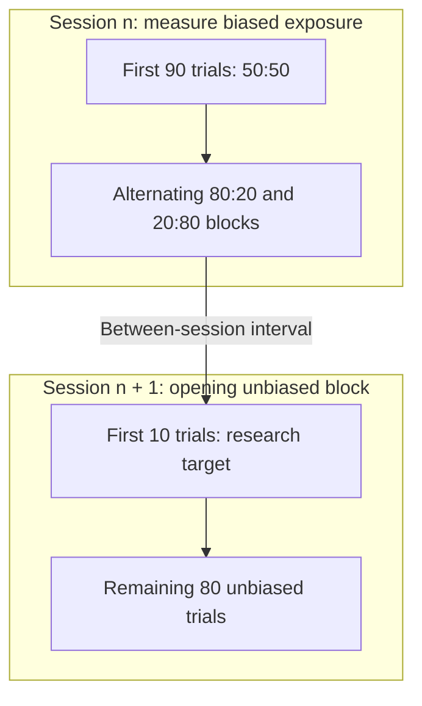

# Cross-session persistence of choice priors in IBL mice

*Neuromatch Academy Computational Neuroscience · Team Horsing Around*

Does what a mouse experiences in one session shape how it chooses in the next? This project uses public International Brain Laboratory (IBL) behavioural data to investigate whether exposure to biased stimulus probabilities carries over into the unbiased opening of a subsequent session.

[Download notebook](01_download_and_assemble_ibl_data.ipynb) · [Preprocessing notebook](02_preprocessing.ipynb) · [Dataset paper](https://doi.org/10.7554/eLife.63711)

> **Current status:** Data-download and preprocessing notebooks are available. The statistical-analysis notebook is forthcoming; results are not included here yet.

## The idea behind the project

Imagine a mouse finishing a session in which visual stimuli appeared more often on the left. When the next session begins, left and right stimuli are equally likely. Does the mouse begin again with a neutral expectation, or does its previous experience still influence its choices?

The IBL task gives us a way to investigate this question. Each eligible session opens with an unbiased block before introducing alternating left- and right-biased blocks. Because those later blocks vary in length, different sessions provide different amounts of exposure to each bias direction.

Our interest is in what happens **across the session boundary**: whether the balance of biased exposure in one session predicts choices before the next session introduces a new biased block.

## Research question and hypothesis

**Question:** Does the proportion of trials spent in left-biased blocks during session *n* predict left-choice probability during the first 10 unbiased trials of session *n + 1*?

**Hypothesis:** Greater exposure to left-biased blocks in the preceding session will predict a greater probability of choosing left in that early window.

Here, “prior persistence” is the research question, not an assumption built into the data. The pipeline measures exposure to task probabilities; it does not directly measure an animal's internal belief.

## The dataset and task

The data come from the IBL's [standardised visual decision-making task](https://doi.org/10.7554/eLife.63711). Head-fixed mice turn a wheel to report the side of a visual grating.

In the selected sessions, the first **90 trials are unbiased**: left and right stimuli are equally likely. Later blocks alternate between **80:20 and 20:80** left:right probabilities. Their lengths vary, and switches are not explicitly signalled.



The schematic highlights the study's target window. The preprocessing notebook retains complete eligible sessions rather than extracting only those first 10 trials.

The download notebook identifies subjects through the `2021_Q1_IBL_et_al_Behaviour` release tag and combines their trial, session, and training-status tables. The recorded download covers 140 mice. The study cohort comprises the 26 mice that eventually reached `ready4recording`.

## Our approach

The preprocessing connects two different pieces of information: **biased exposure in session *n*** and **choices in the immediately following session**.

1. **Select suitable sessions.** For the 26 mice, retain `ready4ephysrig`, `ready4delay`, and `ready4recording` sessions in the `biasedChoiceWorld` or `ephysChoiceWorld` task families. Check that the first 90 trials are unbiased and trial 91 leaves that block. Preceding sessions must also have at least two biased blocks and a terminal block lasting at least 20 trials.

2. **Establish genuine adjacency.** Use each mouse's complete chronological session history, so an intervening ineligible session cannot be silently skipped. Calculate the gap from the estimated end of session *n* to the start of session *n + 1*. Keep gaps of at least 12 hours, with no upper limit at this preprocessing stage. The recorded run produces **359 pairs from 26 mice**.

3. **Quantify previous-session exposure.** Calculate `prop_left` as the number of trials in left-biased blocks divided by the number of trials in all biased blocks. Exclude the opening unbiased block. Weight by trials, rather than blocks, because block lengths vary.

Trials with no response remain in the data while block structure and exposure are calculated. They are removed afterwards from the exported trial-level pools, without renumbering the original trial positions.

The [preprocessing notebook](02_preprocessing.ipynb) contains the full eligibility checks, intermediate counts, variable definitions, and handling of timing anomalies.

## Using this repository

### Notebooks

| Notebook | Purpose |
| --- | --- |
| [01_download_and_assemble_ibl_data.ipynb](01_download_and_assemble_ibl_data.ipynb) | Download and join IBL aggregates, add session-level performance and training-day variables, and save `all_trials.pqt`. |
| [02_preprocessing.ipynb](02_preprocessing.ipynb) | Select the cohort, construct trial and block variables, identify eligible consecutive sessions, calculate exposure, and export processed tables. |

### Setup and execution

The saved notebooks record **Python 3.12.5**. Use a separate Python environment and an internet connection for the data download.

Clone this repository, or download and extract its ZIP archive:

```bash
git clone https://github.com/nmrtm/ibl-cross-session-prior-persistence.git
cd ibl-cross-session-prior-persistence
```

In your activated Python environment, install the dependencies and launch JupyterLab:

```bash
python -m pip install ONE-api ibllib numpy pandas pyarrow matplotlib ipywidgets jupyterlab
python -m jupyterlab
```

Use the kernel belonging to that environment. Run all cells in notebook **01**, then all cells in notebook **02**, from top to bottom. Keep both notebooks in the repository root and run them with that directory as their working directory: notebook 02 expects to find `all_trials.pqt` there.

These commands provide an unpinned setup, not an exact reconstruction of the original environment.

### Generated files

Both notebooks write their outputs to the working directory. The repository's `.gitignore` excludes `.pqt` files.

| File | Contents |
| --- | --- |
| `all_trials.pqt` | Combined trial-level source data. |
| `n_pool.pqt`, `n1_pool.pqt` | Eligible preceding- and subsequent-session trials, after removing no-response trials. |
| `pair_table.pqt` | Consecutive-session pairs, gap lengths, and training-status fields. |
| `prop.pqt` | Previous-session left-biased exposure, calculated before removing no-response trials. |
| `n_summary.pqt` | Preceding-session eligibility and terminal-block summaries. |

The session pools contain all eligible sessions, not only those that appear in a retained pair. Use `pair_table.pqt` to identify paired sessions in downstream analyses.

## Reproducibility and next steps

Exact package versions and IBL aggregate revisions are not yet pinned. Although the download begins with a release-tag lookup, the saved output includes warnings that some aggregate loads selected the most recent available revision. A later download may therefore differ from the recorded run.

The next documentation and release steps are:

- [ ] Add the statistical-analysis notebook and document its analysis-specific filters.
- [ ] Record package versions and the exact aggregate revisions used.
- [ ] Check the complete workflow in a clean environment.
- [ ] Add a code licence and machine-readable citation information.

## Credits and acknowledgements

**Repository maintained by:** [Namrata Muralidharan](https://github.com/nmrtm).

**Original NMA project team — Horsing Around:** Namrata Muralidharan, Tony Shen, Xeniya Gvozdeva, Maryam Alabi, Nirvan Jippan, Gabriele Battaglia and Zohreh Rahmannejad.

The project was developed during Neuromatch Academy Computational Neuroscience 2026, in the Each-Uisge Wormwood pod. Thanks to pod TA Kav Bandara and project TA Arun Kumar.

The International Brain Laboratory generated and released the data. The initial data-loading workflow was adapted from IBL and Neuromatch Academy teaching materials.

**Data reference:** International Brain Laboratory et al. (2021). *Standardized and reproducible measurement of decision-making in mice.* eLife, 10, e63711. [doi:10.7554/eLife.63711](https://doi.org/10.7554/eLife.63711)
